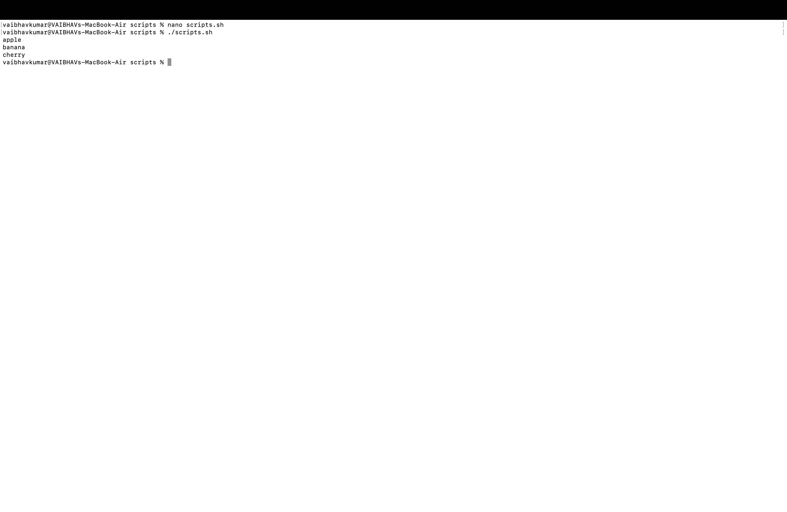

# LAB2.md

## Script 1: print_numbers.sh

**Purpose:**  
Prints numbers from 1 to 5.

**Code:**
```bash
#!/bin/bash
# filepath: Scripts/print_numbers.sh

for i in {1..5}
do
  echo $i
done
```

**Line-by-line Explanation:**
1. `#!/bin/bash` — Shebang; tells the system to use Bash to run the script.
2. `for i in {1..5}` — Loops through numbers 1 to 5.
3. `do` — Starts the loop block.
4. `echo $i` — Prints the current number.
5. `done` — Ends the loop.

**Example Run:**
```shell
$ ./print_numbers.sh
1
2
3
4
5
```

---


## Script 2: array_loop.sh

**Purpose:**  
Prints each element of an array.

**Code:**
```bash
#!/bin/bash
# filepath: Scripts/array_loop.sh

arr=("apple" "banana" "cherry")
for fruit in "${arr[@]}"
do
  echo $fruit
done
```

**Line-by-line Explanation:**
1. `#!/bin/bash` — Shebang; uses Bash shell.
2. `arr=("apple" "banana" "cherry")` — Declares an array with three fruits.
3. `for fruit in "${arr[@]}"` — Loops through each element in the array.
4. `do` — Starts the loop block.
5. `echo $fruit` — Prints the current fruit.
6. `done` — Ends the loop.

**Example Run:**
```shell
$ ./array_loop.sh
apple
banana
cherry
```

---


## Extra Questions

**1. What is the purpose of `#!/bin/bash` at the top of a script?**  
It tells the system to use the Bash shell to interpret and run the script.

**2. How do you make a script executable?**  
Use the command:
```shell
chmod +x scriptname.sh
```
Replace `scriptname.sh` with your script’s